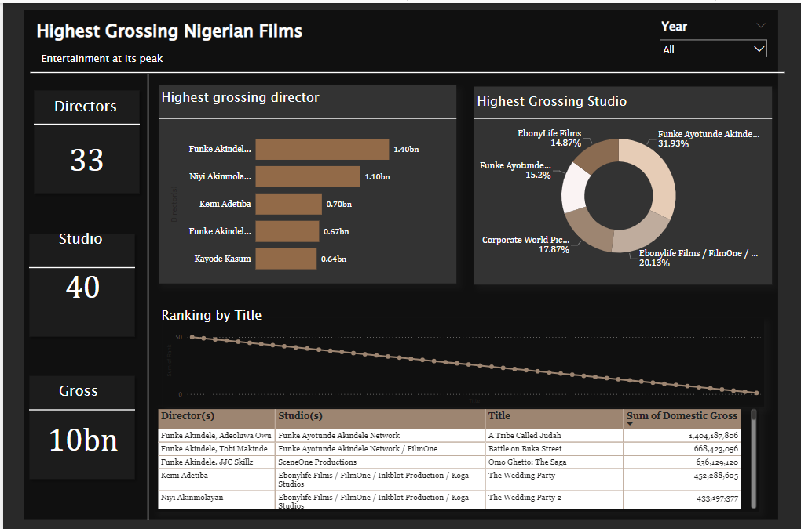

# Highest Grossing Nigerian Movie

The following are the highest-grossing Nigerian films of all time in Nigerian cinemas. Revenues from special screenings, DVD sales, online streaming and theatrical screenings outside English-speaking West Africa are excluded from this gross total. Films from this list have not been adjusted for inflation.

# Problem Statement

1. To discover the directors who gnared the most revenue?
2. What is the ranking of the movies?
3. What studio generates the most revenue?

# Data Source
The data was scrapped off goggle using beautifulSoup. The documentation is above.

# Data Cleaning
The directors column was split via a delimiter. The data just contains top 50 rows. Its also only one file.

# Data Visulization
The visualization is a dashboard.
https://app.powerbi.com/view?r=eyJrIjoiYjAzYjNjNWYtNmI5Yy00NWJmLTkxNTQtZmE2YzkyZmI3ODllIiwidCI6ImUyODE5OGNhLTExOWQtNDhmOC1iYzBlLTczMzIxYTM4YzJlMyJ9

# Nollywood Dashboard

---

# Insights

1. There are distincively 40 studios in this analysis, 33 directors and 10billion naira made in total.
2.  Funke Akindele is at the peak in her career, as she has two highest grossing movie(1.4bn and 670mil) and this was achieved via a combination of herself and other directors at different times hence the variability. Kemi Adetiba led the Wedding Party to its success which was after funke akindele's movie, but Niyi akinmoloyan directed the part 2 and he collectively has made box office shattering movies as compared to Kemi adetiba, hence why hes number 2.
3. Funke akindele network and ebonylife films are owned by women. Funke akindele network solely produced the highest grossing movie in Nigeria Today. And it alsopartned with another production house to release Omo ghetto. Ebonylife has parterned with different studios at different times to release their highest grossing movie.
   
